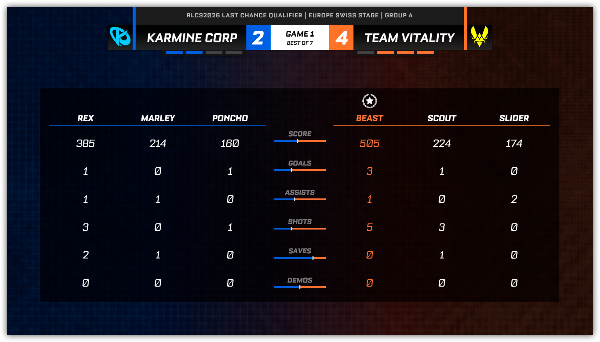
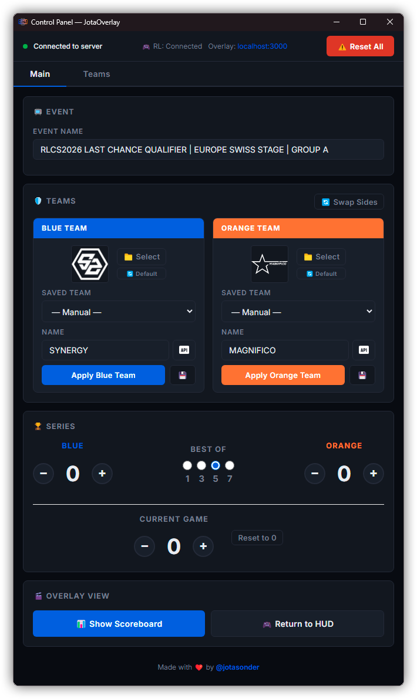
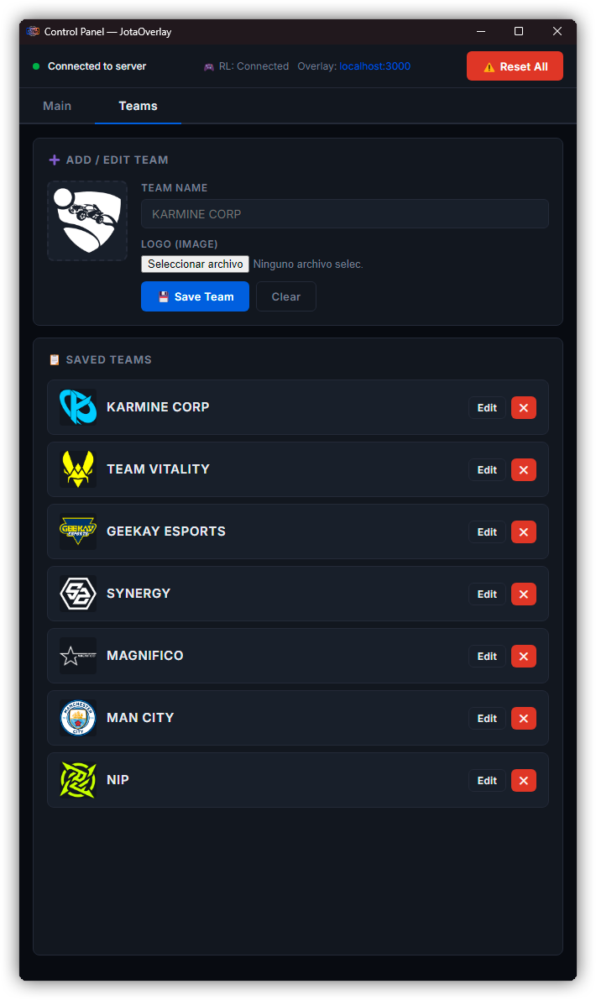

# JotaOverlay — Rocket League Overlay

Este proyecto es un sistema de overlay profesional para retransmisiones de Rocket League, diseñado para integrarse con la **nueva API oficial de stats de Rocket League** (Rocket League Stats API) lanzada junto con la actualización del Easy Anti-Cheat (EAC) de Rocket League en abril de 2026.

## Funciones

*   Integración nativa con la nueva Rocket League Stats API.
*   Overlay automático compatible con programas de retransmisión (OBS, Streamlabs Desktop, etc.) usando fuente de navegador.
    *   Pantalla ingame compatible con 1v1, 2v2, 3v3 y 4v4.
    *   Tags con nombres de jugadores, boost y otros stats.
    *   Pantalla de gol automática con estadísticas del gol (goleador, velocidad y asistente).
    *   Pantalla final de partido con scoreboards y MVP.
*   Panel de control para gestionar nombres de equipos, logos y el marcador de la serie de forma manual. Permite realizar cambios durante el partido.
*   Posibilidad de guardar equipos para su posterior uso de una forma más cómoda.
*   Detección automática de ganadores de partidos y actualización del marcador de la serie.
*   Completamente portable y listo para usar para streamers y casters, simplemente ejecuta el archivo .exe.

## Capturas de pantalla




<p align="center">
  
  
</p>

## Configuración para streaming

1.  **Activar la API oficial:** 
    - [ ] Cierra Rocket League (si esta abierto)
    - [ ] Ve al archivo `<Rocket League installation directory>/TAGame/Config/DefaultStatsAPI.ini`
    - [ ] Cambia el valor de `PacketSendRate` a `30` (o a un valor mayor)
    - [ ] Guarda el archivo
    - [ ] Inicia Rocket League
2.  **Configurar el overlay en tu software de streaming:**
    - [ ] Abre JotaOverlay.exe
    - [ ] En tu software de streaming, crea una nueva fuente de navegador por encima de tu juego:
        *   URL:
        ```javascript
        http://localhost:3000
        ```
        *   Resolución: `1920x1080`
    - [ ] El overlay se mostrará en la pantalla

## 🚀 Arquitectura del Sistema

El programa funciona como un "puente" (bridge) entre los datos del juego y la interfaz visual:

1.  **Capa de Datos (Rocket League):** El juego emite datos en tiempo real a través de su API interna de estadísticas.
2.  **Capa de Servidor (Backend):** Un servidor Node.js (`server.js`) actúa como cliente TCP para recibir, procesar y distribuir estos datos.
3.  **Capa Visual (Frontend):** Tanto el Overlay como el Panel de Control son aplicaciones web que se actualizan mediante WebSockets.

---

## 📂 Guía de Archivos

### 🧠 Núcleo del Sistema
*   **`main.js`**: Punto de entrada de Electron. Configura la ventana del Panel de Control y arranca el servidor backend.
*   **`server.js`**: El componente más crítico. Contiene:
    *   **Cliente TCP**: Se conecta al puerto 49123 del juego.
    *   **Lógica de Estado**: Mantiene la puntuación, tiempo, jugadores activos y eventos de gol.
    *   **Servidor WebSocket**: Re-emite los datos procesados al overlay (puerto 3001).
*   **`package.json`**: Define las dependencias (`express`, `ws`, `electron`) y los comandos de construcción.

### 🎨 Interfaces
*   **`overlay/`**: La parte visual que se importa en el software de streaming (vía Fuente de Navegador).
    *   `index.html`: Estructura del marcador y HUD.
    *   `app.js`: Lógica que recibe los datos del WebSocket (puerto 3001) y actualiza el HTML.
*   **`control-panel/`**: Herramienta para gestionar nombres de equipos, logos y el marcador de la serie de forma manual.

### 📦 Recursos y Persistencia
*   **`assets/`**: Imágenes, logos por defecto y fuentes tipográficas.
*   **`data/`**: Almacena de forma persistente los equipos configurados (`teams.json`) y sus logos.

---

## 🔌 Integración con Rocket League Stats API

Este overlay está diseñado específicamente para trabajar con la **Rocket League Stats API** oficial de Psyonix.

### 1. Conexión Técnica
El servidor se conecta mediante un **Socket TCP** a la dirección local en el puerto **49123**.

```javascript
// Conexión en server.js
rlSocket.connect(49123, '127.0.0.1', () => {
  console.log('[RL] Connected to Stats API (TCP)');
});
```

### 2. Eventos Procesados
El código está preparado para interpretar los paquetes JSON oficiales de la API:
*   `UpdateState`: Actualización general (marcador, tiempo, boost de jugadores).
*   `GoalScored`: Información sobre el autor del gol y velocidad.
*   `ClockUpdatedSeconds`: Sincronización precisa del cronómetro.
*   `MatchCreated` / `MatchEnded`: Reinicio de estados y gestión de series.

### 🛠️ ¿Por qué no está recibiendo datos?
Si el overlay no se actualiza, revisa lo siguiente:
*   **Activar la API:** Para que Rocket League emita estos datos, debes modificar el valor de `PacketSendRate` a al menos `30` en el archivo `<Install Dir>/TAGame/Config/DefaultStatsAPI.ini`.
*   **Uso de la API Oficial:** Esta versión utiliza la API nativa de Rocket League. **No** requiere BakkesMod ni el plugin SOS para funcionar.
*   **Puerto 49123:** Es el puerto estándar de la Stats API. Asegúrate de que no haya un firewall bloqueando el tráfico local en este puerto.
*   **Dirección Local:** El programa busca el juego en `127.0.0.1`. El juego y este programa deben ejecutarse en el mismo PC.

---

## 📦 Construcción del Proyecto (Build)

Para generar el ejecutable portátil (`.exe`) para Windows:

1.  Instala las dependencias: `npm install`
2.  Genera la build: `npm run build`
3.  El archivo resultante aparecerá en la carpeta **`dist/`** como `JotaOverlay.exe`.
